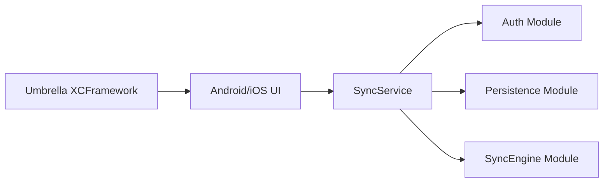

# mobile-sync

Kotlin Multiplatform sync/data stack for Quran mobile apps.

This repository contains shared modules used by Android and iOS apps for:
- Authentication (OIDC)
- Local persistence (SQLDelight)
- Sync engine orchestration
- A unified app-level service API (`SyncService`)

## Table of Contents
- [Architecture](#architecture)
- [Modules](#modules)
- [Requirements](#requirements)
- [Quick Start](#quick-start)
- [Usage](#usage)
- [Run the Demos](#run-the-demos)
- [Build, Test, and Release Commands](#build-test-and-release-commands)
- [Related Repositories](#related-repositories)

## Architecture

`auth` + `persistence` + `syncengine` are composed in `sync-pipelines`, exposed through a DI graph (`AppGraph` / `SharedDependencyGraph`), and exported to iOS through `umbrella`.



## Modules

| Module | Purpose |
|---|---|
| `:auth` | OIDC login/logout, auth state, token handling |
| `:persistence` | SQLDelight DB, repositories for bookmarks/collections/notes/recent pages |
| `:syncengine` | Core sync engine and scheduling |
| `:sync-pipelines` | DI graph and `SyncService` orchestration API |
| `:umbrella` | iOS XCFramework export (`Shared.xcframework`) |
| `:demo:android` | Android sample app (Compose) |
| `:demo:common` | Shared demo helpers/models |
| `:mutations-definitions` | Shared mutation/domain definitions |

## Requirements

- JDK 17
- Android Studio (for Android demo)
- Xcode (for iOS demo)
- Cocoa toolchain for iOS simulator/device builds

Optional but recommended:
- `local.properties` with OAuth credentials:

```properties
OAUTH_CLIENT_ID=your_client_id
OAUTH_CLIENT_SECRET=your_client_secret
```

## Quick Start

1. Clone and enter the repo:
```bash
git clone https://github.com/quran/mobile-sync.git
cd mobile-sync
```

2. Ensure Gradle can resolve dependencies:
```bash
./gradlew help
```

3. Run tests:
```bash
./gradlew allTests --stacktrace --continue
```

## Usage

### 1. Initialize app graph (Android/Kotlin)

```kotlin
import com.quran.shared.auth.di.AuthFlowFactoryProvider
import com.quran.shared.persistence.DriverFactory
import com.quran.shared.pipeline.di.SharedDependencyGraph
import com.quran.shared.syncengine.SynchronizationEnvironment
import org.publicvalue.multiplatform.oidc.appsupport.AndroidCodeAuthFlowFactory

val authFactory = AndroidCodeAuthFlowFactory(useWebView = false)
authFactory.registerActivity(activity)
AuthFlowFactoryProvider.initialize(authFactory)

val graph = SharedDependencyGraph.init(
    driverFactory = DriverFactory(context = applicationContext),
    environment = SynchronizationEnvironment(
        endPointURL = "https://apis-prelive.quran.foundation/auth"
    )
)

val authService = graph.authService
val syncService = graph.syncService
```

### 2. Initialize app graph (iOS/Swift)

```swift
import Shared

final class AppContainer {
    static let shared = AppContainer()
    static var graph: AppGraph { shared.graph }

    let graph: AppGraph

    private init() {
        Shared.AuthFlowFactoryProvider.shared.doInitialize()
        let driverFactory = DriverFactory()
        let environment = SynchronizationEnvironment(
            endPointURL: "https://apis-prelive.quran.foundation/auth"
        )
        graph = SharedDependencyGraph.shared.doInit(
            driverFactory: driverFactory,
            environment: environment
        )
    }
}
```

### 3. Use `SyncService`

Core API examples:
- Observe: `authState`, `bookmarks`, `collectionsWithBookmarks`, `notes`
- Mutations: `addBookmark`, `deleteBookmark`, `addCollection`, `deleteCollection`, `addNote`, `deleteNote`
- Trigger sync: `triggerSync()`

Lifecycle note:
- `SyncService` is app-scoped. Initialize once via `SharedDependencyGraph.init(...)`.
- Do not clear app-scoped services from UI/view-model teardown.

### 4. Build type flavor

`auth` uses BuildKonfig flavor to expose build type values.

Default (`gradle.properties`):
```properties
buildkonfig.flavor=debug
```

Override for release-like builds:
```bash
./gradlew :auth:build -Pbuildkonfig.flavor=release
```

## Run the Demos

### Android demo

1. Open project in Android Studio.
2. Run `demo/android` app module.

CLI build example:
```bash
./gradlew :demo:android:assembleDebug
```

### iOS demo

1. Open:
   `demo/apple/QuranSyncDemo/QuranSyncDemo.xcodeproj`
2. Select `QuranSyncDemo` scheme.
3. Run on an iOS Simulator.

The Xcode project includes a Run Script phase that calls:
```bash
./gradlew :umbrella:embedAndSignAppleFrameworkForXcode
```

CLI build example:
```bash
xcodebuild -project demo/apple/QuranSyncDemo/QuranSyncDemo.xcodeproj \
  -scheme QuranSyncDemo \
  -configuration Debug \
  -destination 'generic/platform=iOS Simulator' \
  build CODE_SIGNING_ALLOWED=NO
```

## Build, Test, and Release Commands

Build all:
```bash
./gradlew build
```

Run all tests:
```bash
./gradlew allTests --stacktrace --continue
```

Build iOS XCFramework:
```bash
./gradlew :umbrella:assembleSharedXCFramework
```

Build Android demo compile target:
```bash
./gradlew :demo:android:compileDebugKotlin
```

Build iOS KMP target:
```bash
./gradlew :sync-pipelines:compileKotlinIosSimulatorArm64
```

## Related Repositories

- [mobile-sync-spm](https://github.com/quran/mobile-sync-spm)
- [quran_android](https://github.com/quran/quran_android)
- [quran-ios](https://github.com/quran/quran-ios)
