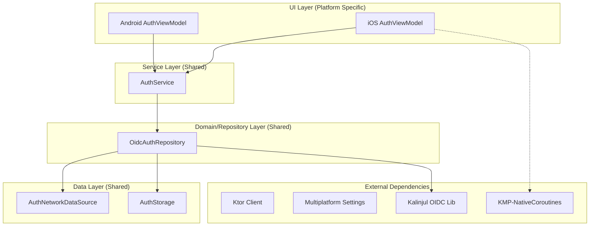

# Quran Auth Module 🔐

A production-grade **Kotlin Multiplatform (KMP)** library for handling authentication with Quran.com. This module leverages **OpenID Connect (OIDC)** with PKCE and provides a seamless, secure authentication experience across Android and iOS using a shared Service architecture and **KMP-NativeCoroutines**.

---

## 🏗 Architecture

The module follows a service-oriented architecture designed for maximum code sharing while providing native performance and lifecycle management on each platform.

### Design Diagram


### 1. **Service Layer (`AuthService`)**
The central hub for authentication logic and state. 
- **Consolidated State**: Manages a single `authState` flow containing Success, Loading, and Error (with UI-friendly messages) states.
- **Platform Bridging**: Uses `@NativeCoroutinesState` and `@NativeCoroutines` to expose Kotlin Flows and suspend functions to iOS as `AsyncSequence` and `async/await`.

### 2. **UI Layer**
- **Android (`AuthViewModel`)**: A thin wrapper around `AuthService` using `androidx.lifecycle.ViewModel`.
- **iOS (`AuthViewModel`)**: A native Swift ViewModel that observes the `authStateFlow` from the shared service, allowing seamless integration with SwiftUI's `@Published` properties.

### 3. **Repository Layer (`OidcAuthRepository`)**
Coordinates token lifecycles, automated refreshes, and process-death survival by persisting OAuth state.

---

## 🚀 Getting Started

### 1. 🔑 Registering your App
1.  Visit the [Quran Foundation Developer Portal](https://quran.foundation).
2.  Set the **Redirect URI** to: `com.quran.oauth://callback`.
3.  Note your **Client ID** and **Client Secret**.

### 2. 🛠 Configuration
Update `local.properties`:
```properties
OAUTH_CLIENT_ID=your_client_id_here
OAUTH_CLIENT_SECRET=your_client_secret_here
```

### 3. 📦 Installation
```kotlin
// auth/build.gradle.kts
plugins {
    id("com.rickclephas.kmp.nativecoroutines")
}

// app/build.gradle.kts
implementation(project(":auth"))
```

### 4. ⚙️ Platform Initialization

#### **Android (`MainActivity.kt`)**
```kotlin
val factory = AndroidCodeAuthFlowFactory(this)
AuthFlowFactoryProvider.initialize(factory)
```

#### **iOS (App Entry Point)**
```swift
// Initialize the global factory provider
AuthFlowFactoryProvider.shared.doInitialize(factory: IosCodeAuthFlowFactory())
```

---

## 💻 Usage

### In Android (Compose)
```kotlin
val authState by viewModel.authState.collectAsState()

when (val state = authState) {
    is AuthState.Success -> WelcomeView(state.userInfo)
    is AuthState.Error -> ErrorView(state.message)
    is AuthState.Loading -> LoadingView()
    else -> LoginView()
}
```

### In iOS (SwiftUI)
```swift
// In native Swift ViewModel
Task {
    for try await state in asyncSequence(for: authService.authStateFlow) {
        self.authState = state
    }
}

// In View
if let success = viewModel.authState as? AuthState.Success {
    Text("Welcome, \(success.userInfo.displayName ?? "User")")
} else if let error = viewModel.authState as? AuthState.Error {
    Text(error.message)
}
```

---

## ✨ Features
- ✅ **Single Source of Truth**: Consolidated `authState` ensures UI consistency.
- ✅ **KMP-NativeCoroutines**: First-class support for Swift Concurrency.
- ✅ **OIDC + PKCE**: Modern, secure authentication flow.
- ✅ **Automatic Refresh**: Proactively refreshes tokens.
- ✅ **Process Death Survival**: Handles lifecycle transitions gracefully.

---

## 🛠 Tech Stack
- **Kotlin Multiplatform**
- **KMP-NativeCoroutines** (Swift/Kotlin Bridge)
- **Ktor Client** (Network)
- **Kotlinx Serialization** (JSON)
- **Multiplatform Settings** (Persistence)
- **Kalinjul OIDC** (Core Auth Logic)
