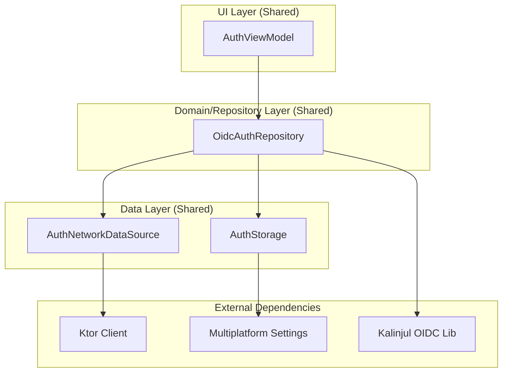

# Quran Auth Module 🔐

A production-grade **Kotlin Multiplatform (KMP)** library for handling authentication with Quran.com. This module leverages **OpenID Connect (OIDC)** with PKCE and provides a seamless, secure authentication experience across Android and iOS.

---

## 🏗 Architecture

The module follows a layered architecture designed for testability, separation of concerns, and platform independence.

### Design Diagram


### 1. **UI Layer (`AuthViewModel`)**
Platform-agnostic ViewModel using `androidx.lifecycle.ViewModel`. It manages `AuthState` (Idle, Loading, Success, Error) and exposes them via `CommonStateFlow` for easy consumption in both Jetpack Compose and SwiftUI.

### 2. **Repository Layer (`OidcAuthRepository`)**
The brain of the module. It coordinates:
- **Token Lifecycle**: Automated refresh with a 5-minute safety margin.
- **Process Death Survival**: Persists OAuth state (`code_verifier`, `state`) to ensure login can continue even if the OS kills the app during browser interaction.
- **Data Coordination**: Prioritizes local storage for `UserInfo` while keeping it synced with the network.

### 3. **Network Layer (`AuthNetworkDataSource`)**
Uses **Ktor** with `ContentNegotiation` and `KotlinxSerialization`. It handles OIDC token exchanges and fetches extended user profiles from the Quran.com API.

### 4. **Persistence Layer (`AuthStorage`)**
Uses `multiplatform-settings` for platform-agnostic key-value storage:
- **Android**: `SharedPreferences`
- **iOS**: `NSUserDefaults`

---

## 🚀 Getting Started

### 1. 🔑 Registering your App
To use this module, you must register your application with **Quran Foundation**:
1.  Visit the [Quran Foundation Developer Portal](https://quran.foundation) (or contact the team for access to the Pre-Production environment).
2.  Create a new **OIDC Client**.
3.  Set the **Redirect URI** to: `com.quran.oauth://callback` (default).
4.  Note your **Client ID** and **Client Secret**.

### 2. 🛠 Configuration
This module uses `BuildKonfig` for secure credential management. Create or update your `local.properties` file in the project root:

```properties
OAUTH_CLIENT_ID=your_client_id_here
OAUTH_CLIENT_SECRET=your_client_secret_here
```

The `AuthConfig` class in the module is pre-configured to use these values and handles the internal endpoints for both production and pre-production environments.

### 3. 📦 Installation
Add the module to your project's `build.gradle.kts`:
```kotlin
implementation(project(":auth"))
```

### 4. ⚙️ Platform Initialization
Since OIDC requires browser redirection, you must initialize the `AuthFlowFactory` in your platform code.

#### **Android (`MainActivity.kt`)**
```kotlin
override fun onCreate(savedInstanceState: Bundle?) {
    super.onCreate(savedInstanceState)
    val factory = AndroidCodeAuthFlowFactory(this)
    AuthFlowFactoryProvider.initialize(factory)
}
```

#### **iOS (`AppDelegate.swift`)**
```swift
func application(_ application: UIApplication, didFinishLaunchingWithOptions ...) -> Bool {
    AuthFlowFactoryProvider.shared.doInitialize(factory: IosCodeAuthFlowFactory())
    return true
}
```

---

## 💻 Usage

### In Shared Code (Compose/SwiftUI)
The `AuthViewModel` handles the heavy lifting.

```kotlin
val viewModel = AuthViewModel()

// Initiate Login
viewModel.login()

// Observe State
val authState by viewModel.authState.collectAsState()

when (val state = authState) {
    is AuthState.Success -> println("Welcome, ${state.user.displayName}")
    is AuthState.Loading -> ShowSpinner()
    is AuthState.Error -> ShowError(state.exception.message)
    else -> ShowLoginButton()
}
```

---

## ✨ Features
- ✅ **OIDC + PKCE**: Modern, secure authentication flow.
- ✅ **Automatic Refresh**: Proactively refreshes tokens 5 minutes before expiration.
- ✅ **JWT Decoder**: Can extract user info from tokens even when offline.
- ✅ **Clock Skew Resistance**: Resilient to device clock mismatches.
- ✅ **KMP Logging**: Integrated with `Kermit` for transparent error tracking.
- ✅ **Process Death Survival**: Handles Android/iOS lifecycle transitions gracefully.

---

## 🛠 Tech Stack
- **Kotlin Multiplatform**
- **Ktor Client** (Network)
- **Kotlinx Serialization** (JSON)
- **Multiplatform Settings** (Persistence)
- **Kermit** (Logging)
- **Kalinjul OIDC** (Core Auth Logic)
